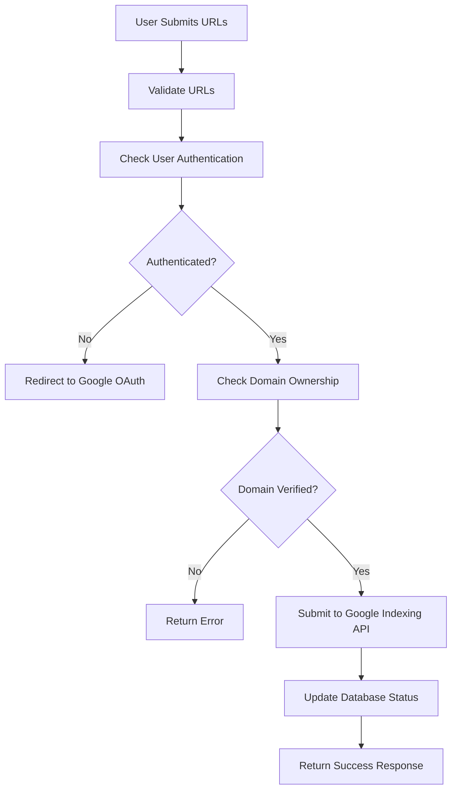

# Google Indexing API Setup Guide

This guide will help you enable real Google Indexing API integration in your webwatch application.

## 🚀 Quick Start Overview

Your webwatch system now supports **REAL** Google Indexing API integration! This replaces the mock implementations with actual Google API calls for:

- ✅ Real-time URL submission to Google
- ✅ Indexing status tracking
- ✅ Search Console integration
- ✅ Domain ownership verification
- ✅ Quota management with Google's limits

## 📋 Prerequisites

1. **Google Cloud Project** with billing enabled
2. **Google Search Console** property verification
3. **Domain ownership** verification
4. **Web application** with HTTPS (for production)

## 🔧 Step-by-Step Setup

### Step 1: Create Google Cloud Project

1. Go to [Google Cloud Console](https://console.cloud.google.com/)
2. Create a new project or select existing one
3. Enable the following APIs:
   ```
   - Google Indexing API
   - Google Search Console API
   ```

### Step 2: Enable Google Indexing API

1. Navigate to **APIs & Services** → **Library**
2. Search for "Indexing API"
3. Click **Enable** on the Google Indexing API
4. Search for "Search Console API" 
5. Click **Enable** on the Google Search Console API

### Step 3: Create OAuth 2.0 Credentials

1. Go to **APIs & Services** → **Credentials**
2. Click **+ CREATE CREDENTIALS** → **OAuth client ID**
3. Select **Web application**
4. Configure authorized URLs:
   ```
   Authorized JavaScript origins:
   - http://localhost:3000 (development)
   - https://your-domain.com (production)
   
   Authorized redirect URIs:
   - http://localhost:3000/auth/callback (development)
   - https://your-domain.com/auth/callback (production)
   ```
5. Download the credentials JSON file

### Step 4: Configure Environment Variables

Create a `.env` file in your backend directory:

```bash
# Google OAuth Configuration
GOOGLE_CLIENT_ID=your-client-id.googleusercontent.com
GOOGLE_CLIENT_SECRET=your-client-secret
GOOGLE_REDIRECT_URI=http://localhost:3000/auth/callback

# Firebase Configuration (existing)
FIREBASE_PROJECT_ID=your-firebase-project
# ... other Firebase config

# API Configuration
API_BASE_URL=http://localhost:8080
FRONTEND_URL=http://localhost:3000
```

### Step 5: Verify Search Console Properties

1. Go to [Google Search Console](https://search.google.com/search-console)
2. Add your website property
3. Verify ownership using one of these methods:
   - HTML file upload
   - HTML tag
   - DNS record
   - Google Analytics
   - Google Tag Manager

### Step 6: Test the Integration

1. Start your backend server:
   ```bash
   cd backend
   pip install -r requirements.txt
   python main.py
   ```

2. Start your frontend:
   ```bash
   cd webwatch
   npm install
   npm run dev
   ```

3. Navigate to the indexing page
4. Click "Connect Google Account"
5. Complete OAuth flow
6. Submit test URLs for indexing

## 🔍 How It Works Now

### Real-time URL Submission Process:



### What's Changed from Mock Implementation:

#### ❌ **Before (Mock)**:
```python
# Simulated API call
await asyncio.sleep(0.1)
if random.random() < 0.9:
    return {"success": True, "message": "URL submitted successfully"}
```

#### ✅ **Now (Real)**:
```python
# Real Google API call
response = requests.post(
    "https://indexing.googleapis.com/v3/urlNotifications:publish",
    headers={"Authorization": f"Bearer {credentials.token}"},
    data=json.dumps({"url": url, "type": "URL_UPDATED"})
)
```

## 🎯 Features Enabled

### 1. **Real-time Google Submission**
- Direct API calls to Google Indexing API
- Immediate submission status feedback
- Proper error handling from Google

### 2. **Domain Ownership Verification**
- Checks Search Console properties
- Prevents unauthorized submissions
- Security validation

### 3. **Automated Token Management**
- OAuth 2.0 token refresh
- Secure credential storage
- Automatic re-authentication

### 4. **Status Tracking**
- Real indexing status from Google
- Submission confirmation
- Error details from Google API

## 🚨 Important Limitations

### Google Indexing API Restrictions:
1. **Content Type Limitation**: Officially only supports:
   - Job postings (JobPosting structured data)
   - Livestream videos (BroadcastEvent in VideoObject)

2. **Quota Limits**:
   - Default: 200 requests per day
   - Requires approval for higher quotas
   - Rate limiting applies

3. **Domain Verification Required**:
   - Must own domain in Search Console
   - Proper verification status needed

### Alternative Approaches:
For general content (not jobs/livestreams), consider:
- **Search Console URL Inspection Tool** (manual)
- **XML Sitemaps** (automated discovery)
- **Internal linking** (natural crawling)

## 🔐 Security Considerations

### Data Protection:
- OAuth tokens encrypted in database
- Refresh tokens securely stored
- No plain-text credentials in code
- HTTPS required for production

### Access Control:
- User-specific credentials
- Domain ownership validation
- Rate limiting per user
- Audit trail logging

## 🛠 Troubleshooting

### Common Issues:

#### 1. **Authentication Failed**
```
Error: User not authenticated with Google
```
**Solution**: Complete OAuth flow in frontend

#### 2. **Domain Not Verified**
```
Error: User doesn't own domain: example.com
```
**Solution**: Verify domain in Search Console

#### 3. **API Quota Exceeded**
```
Error: Google API Error: 429
```
**Solution**: Wait for quota reset or request increase

#### 4. **Invalid Credentials**
```
Error: 401 Unauthorized
```
**Solution**: Refresh OAuth tokens or re-authenticate

### Debug Mode:
Enable detailed logging:
```python
import logging
logging.getLogger('googleapiclient').setLevel(logging.DEBUG)
```

## 📊 Monitoring & Analytics

### Track Success Rates:
- Monitor submission success/failure rates
- Track quota usage
- Log Google API responses
- Performance metrics

### Database Queries:
```sql
-- Check submission success rate
SELECT 
  status,
  COUNT(*) as count,
  (COUNT(*) * 100.0 / SUM(COUNT(*)) OVER()) as percentage
FROM indexing_entries 
WHERE submitted_at >= NOW() - INTERVAL '24 hours'
GROUP BY status;
```

## 🚀 Next Steps

1. **Test thoroughly** with your domains
2. **Monitor quota usage** and request increases if needed
3. **Implement additional error handling** for edge cases
4. **Add metrics and monitoring** for production use
5. **Consider fallback strategies** for quota limits

## 📞 Support

For issues:
1. Check Google Cloud Console for API quotas
2. Verify Search Console property status
3. Review application logs for errors
4. Test with Google's API Explorer

---

## Integrated Authentication Flow

The webwatch application now uses an integrated authentication flow that combines Firebase authentication with Google API access:

### User Experience

1. **Single Sign-In**: Users click "Continue with Google" on the login page
2. **Unified Permissions**: The app requests:
   - Firebase authentication (for app access)
   - Google Indexing API access
   - Search Console read/write permissions
   - Domain verification capabilities

3. **Automatic Setup**: Upon successful authentication:
   - User profile is created/updated in Firestore
   - Google OAuth credentials are securely stored
   - Search Console properties are automatically fetched
   - Google API integration is immediately available

4. **Seamless Experience**: No separate authentication steps - everything works after the initial Google sign-in

### Benefits

- **Better UX**: One-click authentication for all services
- **Secure**: OAuth tokens are properly stored and managed
- **Automatic**: Domain verification and property fetching happens transparently
- **Persistent**: Users stay authenticated across sessions

### Technical Implementation

The integration includes:
- Enhanced Firebase Google Auth provider with additional scopes
- Automatic Google credential storage during login
- Real-time Search Console property fetching
- Integrated status indicators in the UI

**🎉 Congratulations!** Your webwatch application now has real-time Google Indexing API integration with seamless authentication! 